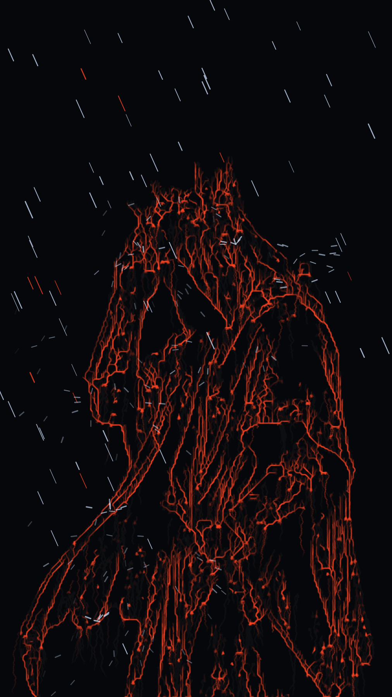
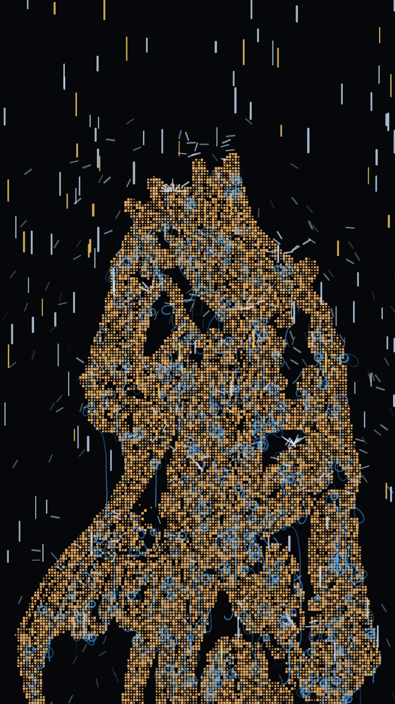
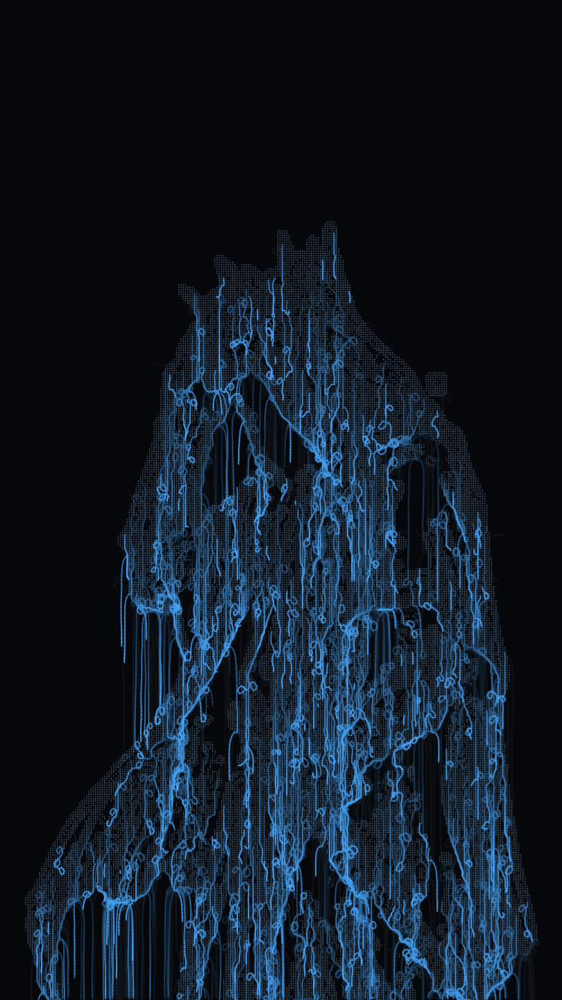

# PixelRain 🌧️

**Interaktive Browser-Kunst: Ein Bild wird in seine Kanten zerlegt — und dann regnet es darauf.**

Die Regentropfen prallen an den Konturen ab, spritzen als kleine Fontänen weg und fließen als Wasser an den Kanten entlang. Alles läuft live im Browser und lässt sich über Regler in Echtzeit verändern.

### ▶️ [Hier direkt im Browser ausprobieren](https://feliperude.github.io/PixelRain/) — nichts zu installieren.

| Standard-Look | Mosaik-Look | Fließendes Wasser |
| :---: | :---: | :---: |
|  |  |  |

## Was passiert da?

1. **Kanten finden** — Das Tool analysiert ein Bild und zeichnet nur dessen Umrisse, als Raster aus Punkten oder Vierecken.
2. **Regen fällt** — Trifft ein Tropfen auf eine Kante, prallt er ab und spritzt als Fontäne weg.
3. **Wasser fließt** — Tausende kleine Teilchen laufen an den Konturen entlang nach unten, wie Regen an einer Fensterscheibe.

Jeder Schritt hat ein eigenes Regler-Panel (Farben, Dichte, Geschwindigkeit, Rasterform u.v.m.). Gute Einstellungen lassen sich als **Presets** speichern, das Ergebnis als **PNG oder GIF** exportieren. Ein eigenes Bild ist per Klick geladen — es bleibt dabei komplett im Browser, nichts wird hochgeladen.

## Selbst ausprobieren

Am einfachsten: die **[Live-Demo](https://feliperude.github.io/PixelRain/)** öffnen.

Oder lokal: Repo laden und einen kleinen Server starten (nötig, damit der Browser das Bild laden darf):

```bash
git clone https://github.com/FelipeRude/PixelRain.git
cd PixelRain
python3 -m http.server 8000
```

Dann im Browser öffnen: **http://localhost:8000**

## Technik

- **Pure JavaScript + [p5.js](https://p5js.org/)** — keine Build-Tools, keine Abhängigkeiten: nur `index.html` und `sketch.js`
- **Eigene Kantenerkennung** (Sobel-Filter) mit Weichzeichnung, Schwellwert, Kanten-Verdünnung und Non-Maximum-Suppression
- **Drei Partikelsysteme** (Regen, Spritzer, Fließ-Agenten), die die erkannten Kanten als Kollisionsraster nutzen
- **Performance:** Kanten werden nur bei Regler-Änderung neu berechnet und in einen Offscreen-Buffer „gebacken“ — die Animation selbst bleibt dadurch flüssig
- Einstellungen und Presets werden lokal im Browser gespeichert (localStorage)
